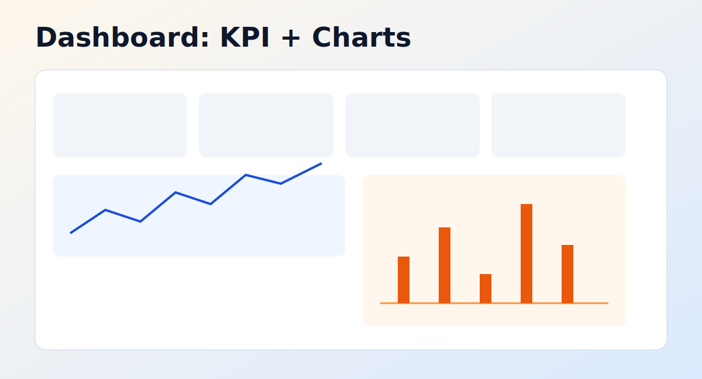
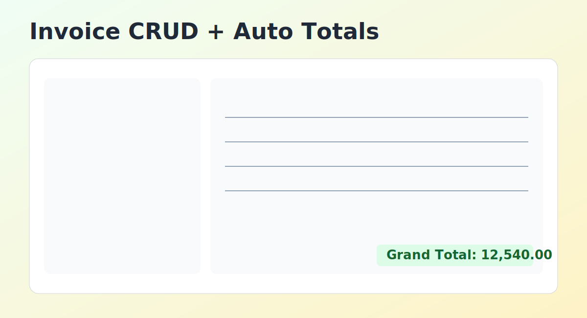
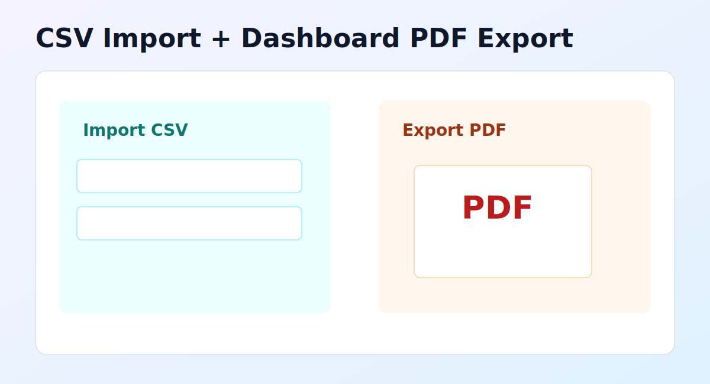

# Stock-Invoice

ระบบจัดการสต็อกและใบขาย (WPF + SQLite) ที่ออกแบบแบบ Demo-first เพื่อให้เริ่มใช้งานและขยายต่อในองค์กรได้เร็ว

## ภาพรวมฟีเจอร์

### Dashboard


- สรุป KPI หลัก: จำนวนสินค้า, สต็อกคงเหลือรวม, ลูกค้า, จำนวนใบขาย
- ยอดขายรายวัน รายเดือน รายปี
- กราฟยอดขาย 7 วันล่าสุด และ 12 เดือนล่าสุด
- กรองช่วงวันที่เองได้ (From/To)
- ตั้งค่าเกณฑ์ Low Stock และไฮไลต์แถวสินค้าใกล้หมด

### Invoice CRUD


- สร้าง/แก้ไข/ลบใบขาย
- เพิ่มหลายรายการสินค้าในใบขาย
- คำนวณ Subtotal/Tax/Grand Total อัตโนมัติ
- บันทึก movement สต็อกอัตโนมัติเมื่อบันทึกใบขาย

### CSV และ PDF


- Import CSV สำหรับ products และ customers
- Export Dashboard report เป็น PDF

## โครงสร้างโปรเจกต์

- StockInvoiceApp: แอป WPF หลัก
- database/sqlite: schema, seed, reset สำหรับ SQLite
- database/sqlserver: schema, seed, reset สำหรับ SQL Server
- docs: เอกสารแผนงานและรูปประกอบ

## วิธีรันในเครื่อง

1. ติดตั้ง .NET SDK 7.0+
2. เปิดโฟลเดอร์ StockInvoiceApp
3. รันคำสั่ง:

```powershell
dotnet run
```

## โหมดการทำงาน

ตั้งค่าที่ StockInvoiceApp/appsettings.json

- AppMode: demo หรือ prod
- ConnectionStrings.DemoDb
- ConnectionStrings.ProdDb
- Seeding.EnableDemoSeed

## Publish และไอคอน Desktop

จากโฟลเดอร์ StockInvoiceApp ให้รัน:

```powershell
powershell -ExecutionPolicy Bypass -File .\scripts\Publish-App.ps1
powershell -ExecutionPolicy Bypass -File .\scripts\Create-DesktopShortcut.ps1
```

- ไฟล์ publish จะอยู่ที่ StockInvoiceApp/publish
- ไอคอน Desktop จะถูกสร้างเป็น StockInvoiceApp.lnk

## GitHub Release v1.0.0

Release asset ที่แนบคือไฟล์ zip ของผลลัพธ์ publish:

- StockInvoiceApp-v1.0.0.zip

## Auto Build (GitHub Actions)

มี workflow สำหรับ build อัตโนมัติทุกครั้งที่ push ไปที่ main อยู่ที่:

- .github/workflows/build.yml

## ลิขสิทธิ์

ซอฟต์แวร์นี้เป็นทรัพย์สินของผู้พัฒนา (apiwi) และสงวนลิขสิทธิ์ทั้งหมด

- รายละเอียดภาษาอังกฤษ: LICENSE
- ประกาศภาษาไทย: COPYRIGHT-TH.md

หากต้องการนำไปใช้ ดัดแปลง หรือเผยแพร่ ต้องได้รับอนุญาตจากเจ้าของลิขสิทธิ์ก่อนเท่านั้น
